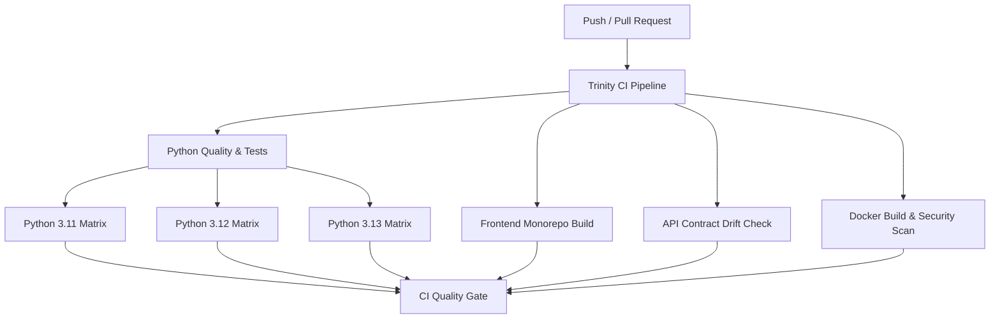

# Trinity AI - Continuous Integration (CI) Guide

This document outlines the Continuous Integration (CI) architecture, automated quality gates, local verification commands, and branch protection policies for the Trinity AI engineering OS monorepo.

---

## 1. Overview

Every Pull Request and push to `main` / `dev` runs through an automated quality pipeline to guarantee security, stability, build integrity, and zero API contract drift.



---

## 2. CI Jobs Breakdown

### 🐍 Python Quality & Tests (`python-ci`)
- **Matrix Testing**: Tests against Python `3.11`, `3.12`, and `3.13` with `astral-sh/setup-uv` caching for ultra-fast, deterministic runs.
- **Ruff Linting**: Checks syntax, undefined symbols, and code quality (`uv run ruff check --select E9,F .`).
- **Pytest Suite**: Executes the complete test suite (API contracts, auth, designs, firmware, gap features, math security, queue, and workflow execution) with JUnit XML reporting.
- **Alembic Database Check**: Applies database migrations (`uv run alembic upgrade head`) and verifies model-schema synchronization (`uv run alembic check`).
- **Test Artifacts**: Uploads test results for each matrix version with 7-day retention.

### ⚛️ Frontend Monorepo Quality & Build (`frontend-ci`)
- **Node & pnpm**: Runs Node.js 22 with frozen lockfile validation (`pnpm install --frozen-lockfile`).
- **TypeScript Typecheck**: Compiles and checks types across the configured workspace packages (`pnpm run typecheck`). The current workspace has three `artifacts` packages, four `lib` packages, and one `scripts` package.
- **Production Builds**: Builds production bundles for `@workspace/trinity` (Vite + React) and `@workspace/mockup-sandbox`.

### 📜 API Contract & Drift Check (`api-contract-drift`)
- Validates OpenAPI 3.0 specification at `lib/api-spec/openapi.yaml`.
- Executes Orval codegen to guarantee that generated React Query hooks (`lib/api-client-react`) and Zod schemas (`lib/api-zod`) are strictly synchronized with `openapi.yaml`. Fails if uncommitted drift is detected.

### 🐳 Docker Build & Security Scan (`docker-validation`)
- Validates Docker Compose configuration (`deploy/docker-compose.yml`) using `deploy/.env.example`.
- Builds Docker images with GitHub Actions layer caching:
  - `artifacts/api-server/Dockerfile` (Backend FastAPI server)
  - `deploy/frontend.Dockerfile` (Multi-stage Node.js + Nginx frontend)
  - `workers/firmware/Dockerfile` (Firmware compilation sandbox)
- Scans container images with **Aqua Security Trivy** for `CRITICAL` and `HIGH` CVE vulnerabilities.

### 🛡️ Scheduled Security & SAST (`security.yml`)
- Runs **GitHub CodeQL** static analysis across Python and TypeScript/JavaScript codebases.
- Performs automated dependency vulnerability audits using `pip-audit` and `pnpm audit`.
- Runs automatically on a weekly schedule (`cron: "0 4 * * 1"`) and on manual trigger.

### 🏷️ PR Hygiene & Governance (`pr-hygiene.yml`)
- Enforces [Conventional Commits](https://www.conventionalcommits.org/) for PR titles (e.g. `feat:`, `fix:`, `ci:`, `docs:`, `deps:`, `chore:`).
- Automatically applies area labels (`area/backend`, `area/frontend`, `area/workers`, `area/contracts`, etc.) via [`.github/labeler.yml`](file:///d:/trinity%20ai/trinity-ai-system/.github/labeler.yml).

### 🤖 Dependabot Maintenance (`dependabot.yml`)
- Monthly automated dependency updates for:
  - GitHub Actions (`github-actions`)
  - Python packages (`pip` / `pyproject.toml`)
  - Node workspace packages (`npm` / `package.json`)
  - Docker base images (`docker`)
- Updates are grouped by ecosystem and directory, with at most one open Dependabot PR per update source.
- Dependabot-generated PRs are exempt from human Conventional Commit title validation; human-authored PRs remain subject to it.
- Dependency and base-image updates still require review and passing CI before merging.

CodeQL is configured as an optional job because GitHub code scanning must be enabled for this private repository before CodeQL can upload results. Set the repository variable `CODEQL_ENABLED=true` only after enabling that GitHub feature. The Python and Node dependency audits remain available without CodeQL.

---

## 3. Running CI Checks Locally

Before opening a pull request, run the same checks locally:

### Python & Backend Checks
```bash
# 1. Sync dependencies into virtual environment
uv sync

# The API contract test imports PyYAML; add it to the declared project
# dependencies before relying on a clean-environment test run.

# 2. Run Ruff linter
uv run ruff check --select E9,F .

# 3. Auto-fix linting issues
uv run ruff check --fix .

# 4. Run all pytest unit tests
uv run pytest

# 5. Test database migrations
uv run alembic upgrade head
uv run alembic check
```

### Frontend & Monorepo Checks
```bash
# 1. Install workspace dependencies
pnpm install --frozen-lockfile

# 2. Typecheck all packages and apps
pnpm run typecheck

# 3. Build frontend web apps
pnpm --filter @workspace/trinity run build
pnpm --filter @workspace/mockup-sandbox run build
```

### API Contract Regeneration & Drift Check
```bash
# Regenerate API client hooks and Zod schemas from openapi.yaml
pnpm --filter @workspace/api-spec run codegen

# Verify no uncommitted drift
git status
```

### Docker Compose & Container Builds
```bash
# Prepare environment file
cp deploy/.env.example deploy/.env

# Validate compose configuration
docker compose -f deploy/docker-compose.yml config

# Build backend container
docker build -t trinity-api -f artifacts/api-server/Dockerfile artifacts/api-server

# Build frontend container
docker build -t trinity-frontend -f deploy/frontend.Dockerfile .

# Build firmware sandbox container
docker build -t trinity-firmware -f workers/firmware/Dockerfile workers/firmware
```

---

## 4. Recommended GitHub Branch Protection Rules

To enforce CI quality on GitHub:
1. Navigate to **Settings** → **Branches** → **Branch protection rules** (or **Rulesets**).
2. Add a rule for target branches (`main`, `dev`).
3. Enable **"Require status checks to pass before merging"**.
4. Require the following status checks:
   - `CI Quality Gate`
   - `Lint PR Title (Conventional Commits)`
5. Enable **"Require branches to be up to date before merging"**.
