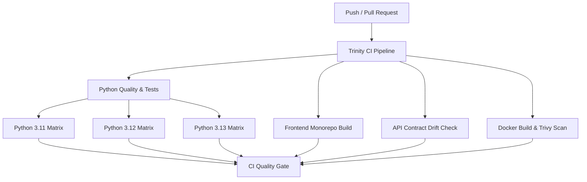

# Trinity AI - Continuous Integration (CI) Guide

This document outlines the Continuous Integration (CI) architecture, automated quality gates, and local verification commands for the Trinity AI engineering OS monorepo.

---

## 1. Overview

Every Pull Request and commit to `main` / `dev` runs through an automated quality pipeline to guarantee security, stability, and zero API contract drift.



---

## 2. CI Jobs Breakdown

### 🐍 Python Quality & Tests (`python-ci`)
- **Matrix**: Tests against Python `3.11`, `3.12`, and `3.13` using `uv` caching.
- **Ruff Linting**: Fast syntax, import, and logic error detection (`ruff check --select E9,F .`).
- **Pytest Suite**: Runs unit tests, engine validations, and security regressions with JUnit XML reporting.
- **Alembic Database Check**: Applies migrations (`alembic upgrade head`) and confirms schema consistency with SQLAlchemy models (`alembic check`).

### ⚛️ Frontend Monorepo Quality & Build (`frontend-ci`)
- **Node & pnpm**: Runs Node.js 22 with frozen pnpm lockfile (`pnpm install --frozen-lockfile`).
- **Typecheck**: Full TypeScript typechecking across all workspace packages (`pnpm run typecheck`).
- **Production Builds**: Compiles `@workspace/trinity` (Vite + React) and `@workspace/mockup-sandbox`.

### 📜 API Contract & Drift Check (`api-contract-drift`)
- Validates OpenAPI schema at `lib/api-spec/openapi.yaml`.
- Executes Orval codegen to guarantee that generated React Query hooks (`lib/api-client-react`) and Zod schemas (`lib/api-zod`) are strictly synchronized with the OpenAPI contract.

### 🐳 Docker Build & Security Scan (`docker-validation`)
- Verifies `deploy/docker-compose.yml` configuration syntax.
- Builds Docker images with Buildx layer caching:
  - `artifacts/api-server/Dockerfile` (Backend API)
  - `deploy/frontend.Dockerfile` (Nginx + Frontend)
  - `workers/firmware/Dockerfile` (Firmware Sandbox Worker)
- Scans container images with **Aqua Security Trivy** for critical and high CVE vulnerabilities.

### 🛡️ Scheduled Security & SAST (`security.yml`)
- Runs **GitHub CodeQL** static analysis across Python and TypeScript codebases.
- Performs automated dependency vulnerability audits using `pip-audit` and `pnpm audit`.

### 🏷️ PR Hygiene & Governance (`pr-hygiene.yml`)
- Enforces [Conventional Commits](https://www.conventionalcommits.org/) for PR titles (e.g. `feat:`, `fix:`, `ci:`, `docs:`, `refactor:`).
- Automatically applies area labels based on modified file paths.

---

## 3. Running CI Checks Locally

Before opening a pull request, you can run the exact same checks on your local machine:

### Python & Backend Checks
```bash
# 1. Sync dependencies with uv
uv sync

# 2. Run Ruff linter
uvx ruff check --select E9,F .

# 3. Run all pytest unit tests
uv run pytest

# 4. Test database migrations
uv run alembic upgrade head
uv run alembic check
```

### Frontend & Monorepo Checks
```bash
# 1. Install workspace dependencies
pnpm install --frozen-lockfile

# 2. Typecheck all packages and apps
pnpm run typecheck

# 3. Build frontend apps
pnpm --filter @workspace/trinity run build
pnpm --filter @workspace/mockup-sandbox run build
```

### API Contract Regeneration & Drift Check
```bash
# Regenerate API client hooks and Zod schemas from openapi.yaml
pnpm --filter @workspace/api-spec run codegen

# Verify no uncommitted drift
git status
```

### Docker Builds
```bash
# Validate compose
docker compose -f deploy/docker-compose.yml config

# Build backend container
docker build -t trinity-api -f artifacts/api-server/Dockerfile artifacts/api-server

# Build frontend container
docker build -t trinity-frontend -f deploy/frontend.Dockerfile .
```

---

## 4. Recommended GitHub Branch Protection Rules

To enforce CI quality on GitHub:
1. Go to repository **Settings** → **Branches** → **Branch protection rules**.
2. Add a rule for `main`.
3. Check **"Require status checks to pass before merging"**.
4. Search for and require:
   - `CI Quality Gate`
   - `Lint PR Title (Conventional Commits)`
5. Check **"Require branches to be up to date before merging"**.
